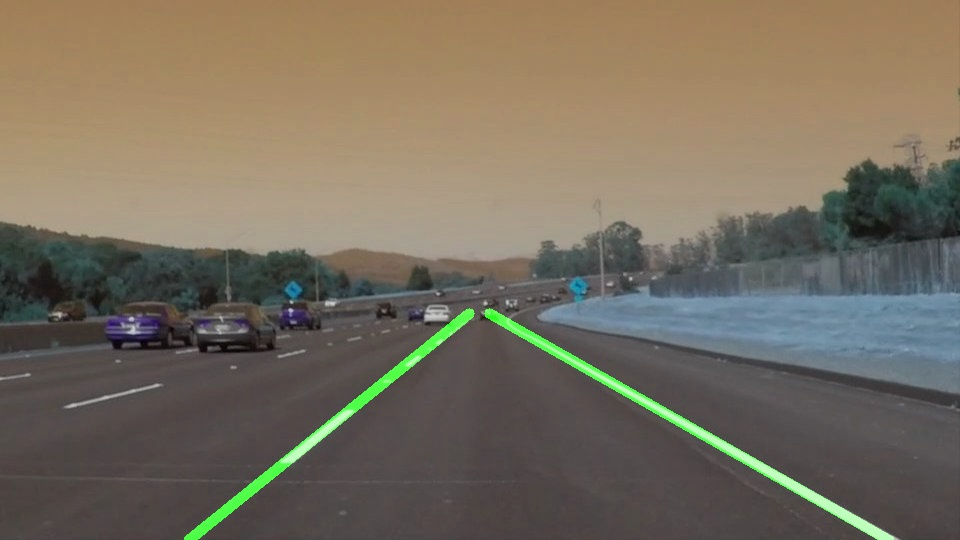
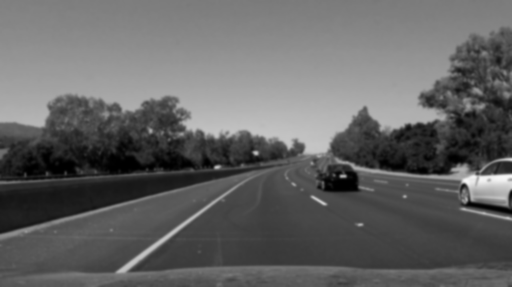
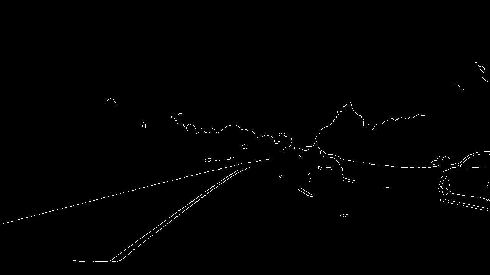
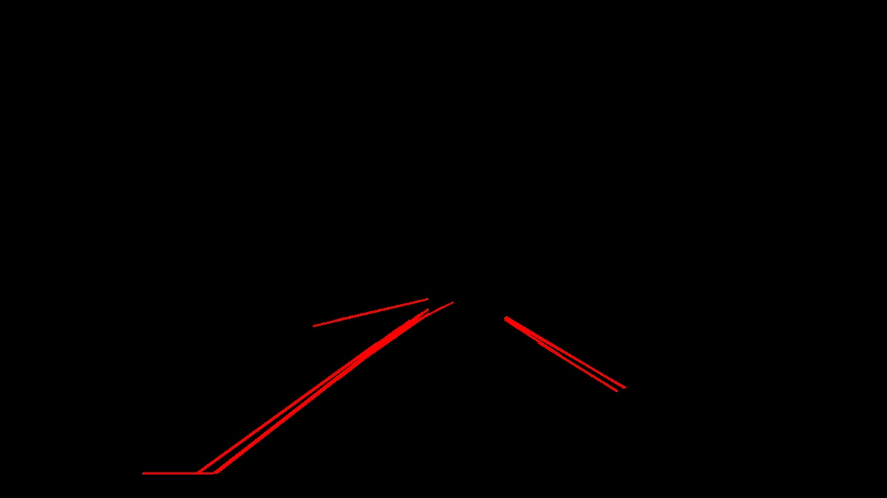
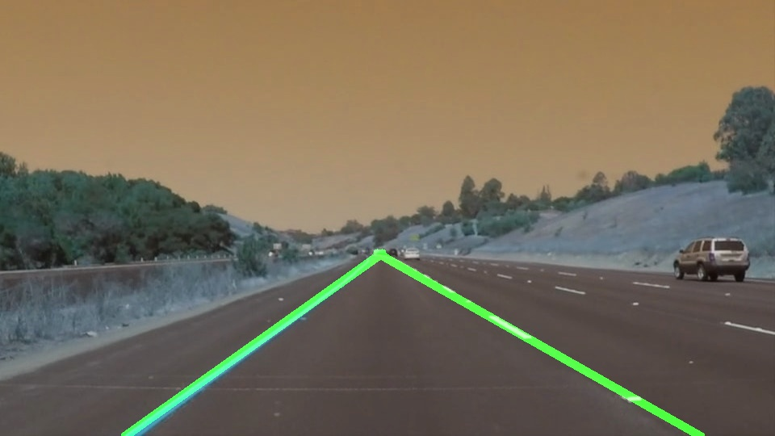

# **Finding Lane Lines on the Road** 

**Finding Lane Lines on the Road**

While driving a vehicle, human eyes act as a camera and captures the series of clips of the lanes ahead of us. Our brain process these clips and instruct us to either move right or left the vehicle in a lane. Idea is to write a code which more or less repeats what human body does. The first step in this is to capture the lanes and identify the actual lanes for the vehicle. 

In this project, our goal is process the multiple images in a folder and identify the lanes and mark them in continous green line. Once the code works as expected on the image, same idea will be applied to a video, which is nothing but the series of images one after another.

The goal is process the image in following steps -
1. Convert the image to gray scale
2. Apply Guassian transformation
3. Apply Canny transformations
4. Apply hough algorithm only to the region of interest (roi)
5. Average the slope, interception of the lines gathered from hough algorithm and extrapolate it

Example Original Image

Example Expected Result

### Reflection

### 1. Describe your pipeline. As part of the description, explain how you modified the draw_lines() function.

My pipeline consisted of 5 steps as mentioned above. First, I converted the images to grayscale, then converted grayscale image is applied Gaussian and Canny transformations. Once the image is Canny transformed by passing a suitable parameters, the end result image is passed through hough transformation to get the image transformed to get only lines pertaining to the lanes. I modified the supplied hough line function to return the lines data along with images.

Once the lines data is received, this data is passed through mainly three custom functions - 
1. Find average slope and intercept
2. Find the x and y of two points of a line (conversion of lines into pixels)
3. Draw the continous line by using addWeighted function of open cv

Let's see how the test image solidYellowCurve.jpg is processed through different steps

Original Image

Guassian Transformation

Canny Transformation

Region of Interest Transformation

Hough Transformation

Average/Extrapoloate hough transformation

### 2. Identify potential shortcomings with your current pipeline

The current program works well on the images, but when the solid yellow lines are faded on the road, the current steps is failing to determine at some stage. Also if the camera is placed on the hood, it is hard to eleminate the hood image by considering roi close to the bottom edge. 

### 3. Suggest possible improvements to your pipeline

To identify the lines properly on the screen, it is hard to identify the yellow and white lines from the image, before they are converted to gray scale and this transformed information can be later used to make sure yellow solid lines are included properly for lane finding. Faded yellow line almost disappears after grayscale and guassian transformation.

Also, during the ROI calculation it is important to avoid considering a part of image close to the bottom edge to avoid including any car parts into the consideration for lane finding. This can be easily done by adjusting the ROI vertices in the code.